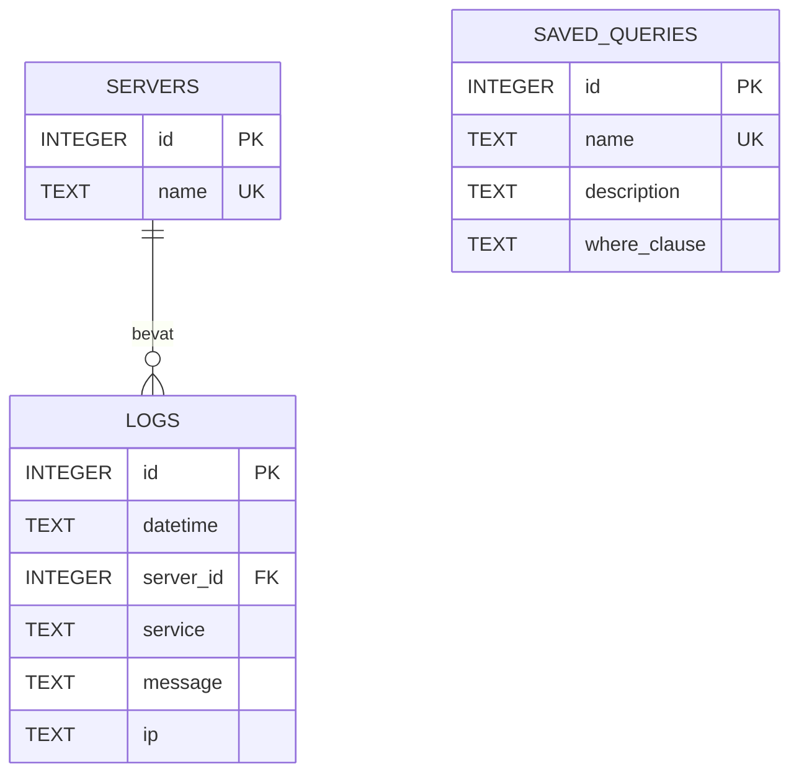

# ERD van de uitgebreide forensic syslogtool

## Uitleg

- Eén server kan nul, één of meerdere logregels hebben.
- Iedere logregel hoort bij precies één server.
- `saved_queries` staat los van servers. Dezelfde opgeslagen query kan daardoor op iedere gekozen server en tijdsperiode worden uitgevoerd.
- Een opgeslagen query bevat alleen de voorwaarde die normaal na `WHERE` staat. De applicatie voegt zelf de gekozen server en tijdsperiode toe.
