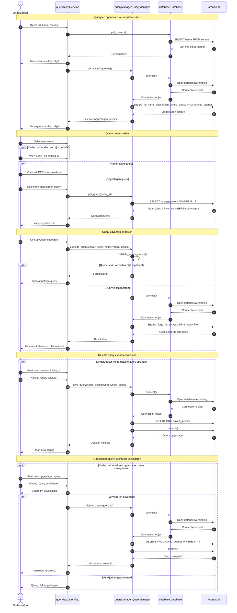

### Dit is de volledige Mermaid Message Sequence Diagram – query’s uitvoeren en beheren
### De losse onderdelen zijn als PNG afbeelding in docs terug te vinden

```mermaid
sequenceDiagram
    autonumber

    actor Onderzoeker
    participant QueryTab as queryTab:QueryTab
    participant QueryManager as queryManager:QueryManager
    participant Database as database:Database
    participant SQLite as forensic.db

    Note over Onderzoeker,SQLite: Querytab openen en keuzelijsten vullen

    Onderzoeker->>QueryTab: Opent tab Onderzoeken
    QueryTab->>Database: get_servers()
    Database->>SQLite: SELECT name FROM servers
    SQLite-->>Database: Lijst met servernamen
    Database-->>QueryTab: Servernamen
    QueryTab-->>Onderzoeker: Toon servers in keuzelijst

    QueryTab->>QueryManager: get_saved_queries()
    QueryManager->>Database: connect()
    Database->>SQLite: Open databaseverbinding
    SQLite-->>Database: Connection-object
    Database-->>QueryManager: Connection-object
    QueryManager->>SQLite: SELECT id, name, description, where_clause FROM saved_queries
    SQLite-->>QueryManager: Opgeslagen query's
    QueryManager-->>QueryTab: Lijst met opgeslagen query's
    QueryTab-->>Onderzoeker: Toon query's in keuzelijst

    Note over Onderzoeker,SQLite: Query samenstellen

    Onderzoeker->>QueryTab: Selecteert server

    opt Onderzoeker kiest een tijdsperiode
        Onderzoeker->>QueryTab: Voert begin- en eindtijd in
    end

    alt Handmatige query
        Onderzoeker->>QueryTab: Voert WHERE-voorwaarde in
    else Opgeslagen query
        Onderzoeker->>QueryTab: Selecteert opgeslagen query
        QueryTab->>QueryManager: get_query(query_id)
        QueryManager->>SQLite: SELECT querygegevens WHERE id = ?
        SQLite-->>QueryManager: Naam, beschrijving en WHERE-voorwaarde
        QueryManager-->>QueryTab: Querygegevens
        QueryTab-->>Onderzoeker: Vul queryvelden in
    end

    Note over Onderzoeker,SQLite: Query uitvoeren en testen

    Onderzoeker->>QueryTab: Klikt op Query uitvoeren
    QueryTab->>QueryManager: execute_query(server, begin, einde, where_clause)

    QueryManager->>QueryManager: validate_where_clause()

    alt Query bevat verboden SQL-opdracht
        QueryManager-->>QueryTab: Foutmelding
        QueryTab-->>Onderzoeker: Toon ongeldige query
    else Query is toegestaan
        QueryManager->>Database: connect()
        Database->>SQLite: Open databaseverbinding
        SQLite-->>Database: Connection-object
        Database-->>QueryManager: Connection-object

        QueryManager->>SQLite: SELECT logs met server-, tijd- en queryfilter
        SQLite-->>QueryManager: Geselecteerde logregels
        QueryManager-->>QueryTab: Resultaten
        QueryTab-->>Onderzoeker: Toon resultaten in scrollbare tabel
    end

    Note over Onderzoeker,SQLite: Geteste query eventueel opslaan

    opt Onderzoeker wil de geteste query opslaan
        Onderzoeker->>QueryTab: Voert naam en beschrijving in
        Onderzoeker->>QueryTab: Klikt op Query opslaan
        QueryTab->>QueryManager: save_query(naam, beschrijving, where_clause)
        QueryManager->>Database: connect()
        Database->>SQLite: Open databaseverbinding
        SQLite-->>Database: Connection-object
        Database-->>QueryManager: Connection-object
        QueryManager->>SQLite: INSERT INTO saved_queries
        QueryManager->>SQLite: commit()
        SQLite-->>QueryManager: Query opgeslagen
        QueryManager-->>QueryTab: Opslaan voltooid
        QueryTab-->>Onderzoeker: Toon bevestiging
    end

    Note over Onderzoeker,SQLite: Opgeslagen query eventueel verwijderen

    opt Onderzoeker wil een opgeslagen query verwijderen
        Onderzoeker->>QueryTab: Selecteert opgeslagen query
        Onderzoeker->>QueryTab: Klikt op Query verwijderen
        QueryTab-->>Onderzoeker: Vraag om bevestiging

        alt Verwijderen bevestigd
            QueryTab->>QueryManager: delete_query(query_id)
            QueryManager->>Database: connect()
            Database->>SQLite: Open databaseverbinding
            SQLite-->>Database: Connection-object
            Database-->>QueryManager: Connection-object
            QueryManager->>SQLite: DELETE FROM saved_queries WHERE id = ?
            QueryManager->>SQLite: commit()
            SQLite-->>QueryManager: Query verwijderd
            QueryManager-->>QueryTab: Verwijderen voltooid
            QueryTab-->>Onderzoeker: Vernieuw keuzelijst
        else Verwijderen geannuleerd
            QueryTab-->>Onderzoeker: Query blijft opgeslagen
        end
    end
```
