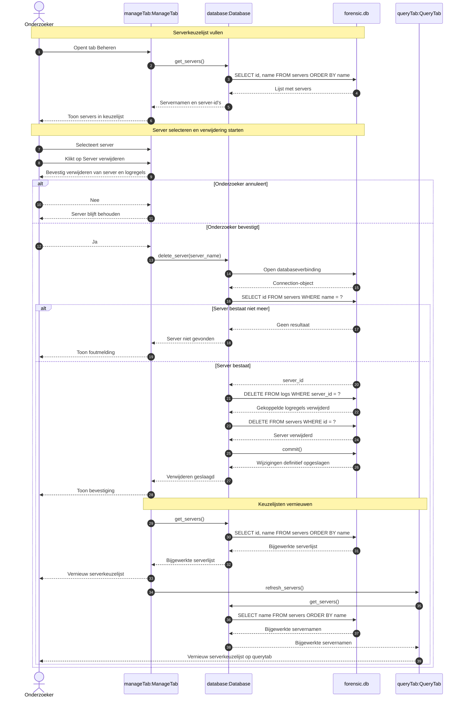

```mermaid
sequenceDiagram
    autonumber

    actor Onderzoeker
    participant ManageTab as manageTab:ManageTab
    participant Database as database:Database
    participant SQLite as forensic.db
    participant QueryTab as queryTab:QueryTab

    Note over Onderzoeker,SQLite: Serverkeuzelijst vullen

    Onderzoeker->>ManageTab: Opent tab Beheren
    ManageTab->>Database: get_servers()
    Database->>SQLite: SELECT id, name FROM servers ORDER BY name
    SQLite-->>Database: Lijst met servers
    Database-->>ManageTab: Servernamen en server-id's
    ManageTab-->>Onderzoeker: Toon servers in keuzelijst

    Note over Onderzoeker,SQLite: Server selecteren en verwijdering starten

    Onderzoeker->>ManageTab: Selecteert server
    Onderzoeker->>ManageTab: Klikt op Server verwijderen

    ManageTab-->>Onderzoeker: Bevestig verwijderen van server en logregels

    alt Onderzoeker annuleert
        Onderzoeker-->>ManageTab: Nee
        ManageTab-->>Onderzoeker: Server blijft behouden

    else Onderzoeker bevestigt
        Onderzoeker-->>ManageTab: Ja
        ManageTab->>Database: delete_server(server_name)

        Database->>SQLite: Open databaseverbinding
        SQLite-->>Database: Connection-object

        Database->>SQLite: SELECT id FROM servers WHERE name = ?

        alt Server bestaat niet meer
            SQLite-->>Database: Geen resultaat
            Database-->>ManageTab: Server niet gevonden
            ManageTab-->>Onderzoeker: Toon foutmelding

        else Server bestaat
            SQLite-->>Database: server_id

            Database->>SQLite: DELETE FROM logs WHERE server_id = ?
            SQLite-->>Database: Gekoppelde logregels verwijderd

            Database->>SQLite: DELETE FROM servers WHERE id = ?
            SQLite-->>Database: Server verwijderd

            Database->>SQLite: commit()
            SQLite-->>Database: Wijzigingen definitief opgeslagen

            Database-->>ManageTab: Verwijderen geslaagd
            ManageTab-->>Onderzoeker: Toon bevestiging

            Note over ManageTab,QueryTab: Keuzelijsten vernieuwen

            ManageTab->>Database: get_servers()
            Database->>SQLite: SELECT id, name FROM servers ORDER BY name
            SQLite-->>Database: Bijgewerkte serverlijst
            Database-->>ManageTab: Bijgewerkte serverlijst
            ManageTab-->>Onderzoeker: Vernieuw serverkeuzelijst

            ManageTab->>QueryTab: refresh_servers()
            QueryTab->>Database: get_servers()
            Database->>SQLite: SELECT name FROM servers ORDER BY name
            SQLite-->>Database: Bijgewerkte servernamen
            Database-->>QueryTab: Bijgewerkte servernamen
            QueryTab-->>Onderzoeker: Vernieuw serverkeuzelijst op querytab
        end
    end
```
