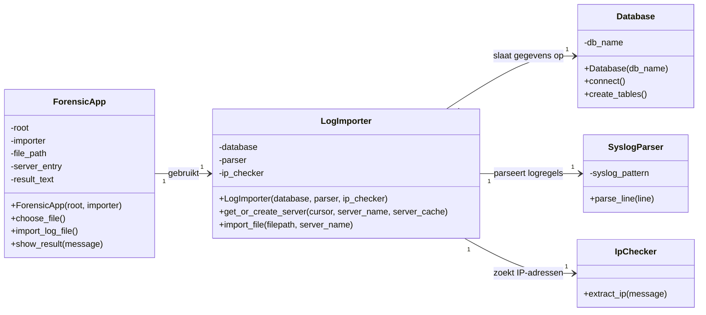

# Klassediagram import — toelichting

**Opleiding:** Fontys Master Docent ICT  
**Versie:** 1.0  
**Auteur:** Rudy Bouland  
**Datum:** 11-06-2026  

## Klassediagram

Het klassediagram is gemaakt met Mermaid en beschrijft de klassen die betrokken zijn bij het importeren van syslogbestanden.



## Betekenis van de associaties

### `ForensicApp` gebruikt `LogImporter`

De GUI importeert zelf geen logregels. Wanneer de gebruiker op **Importeren** klikt, roept de GUI de importer aan:

```python
imported, failed = self.importer.import_file(
    filepath,
    server_name
)
```

### `LogImporter` gebruikt `Database`

De importer heeft een databaseobject nodig om verbinding te maken en logregels op te slaan:

```python
connection = self.database.connect()
```

### `LogImporter` gebruikt `SyslogParser`

Elke regel uit het bestand wordt naar de parser gestuurd:

```python
parsed = self.parser.parse_line(line)
```

De parser geeft daarna een dictionary terug met:

- datum en tijd;
- server;
- service;
- melding.

### `LogImporter` gebruikt `IpChecker`

Na het parseren controleert de importer of de melding een IP-adres bevat:

```python
ip_address = self.ip_checker.extract_ip(
    parsed["message"]
)
```

## Objecten aanmaken en koppelen

`main.py` maakt de objecten aan en koppelt ze aan elkaar:

```python
database = Database("forensic.db")
parser = SyslogParser()
ip_checker = IpChecker()

importer = LogImporter(
    database,
    parser,
    ip_checker
)

app = ForensicApp(
    root,
    importer
)
```

`main.py` staat niet in het klassediagram, omdat het een Python-module is en geen klasse. Het bestand is wel verantwoordelijk voor het aanmaken en verbinden van de objecten.
