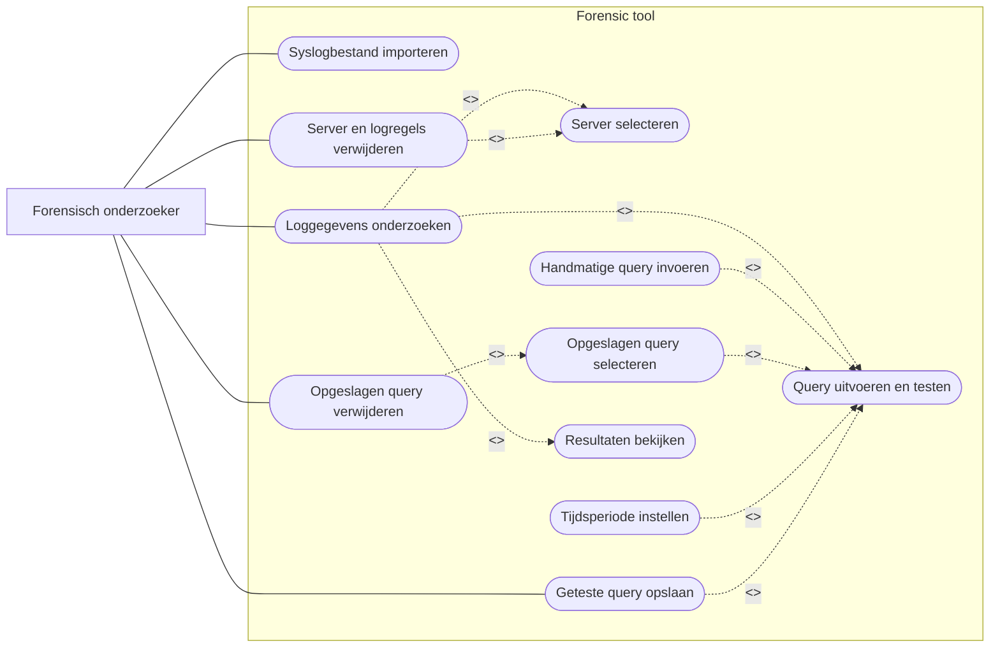

### Mermaid kan geen UC diagram maken met rondjes en poppetjes, echter leent een flowchart zich daar ook prima voor

## Use Case-diagram forensic tool

```mermaid
flowchart LR

    Actor["Forensisch onderzoeker"]

    subgraph Systeem["Forensic tool"]
        direction TB

        UC1(["Syslogbestand importeren"])
        UC2(["Server selecteren"])
        UC3(["Loggegevens onderzoeken"])
        UC4(["Handmatige query invoeren"])
        UC5(["Opgeslagen query selecteren"])
        UC6(["Tijdsperiode instellen"])
        UC7(["Query uitvoeren en testen"])
        UC8(["Resultaten bekijken"])
        UC9(["Geteste query opslaan"])
        UC10(["Opgeslagen query verwijderen"])
        UC11(["Server en logregels verwijderen"])
    end

    Actor --- UC1
    Actor --- UC3
    Actor --- UC9
    Actor --- UC10
    Actor --- UC11

    UC3 -. "<<include>>" .-> UC2
    UC3 -. "<<include>>" .-> UC7
    UC3 -. "<<include>>" .-> UC8

    UC4 -. "<<extend>>" .-> UC7
    UC5 -. "<<extend>>" .-> UC7
    UC6 -. "<<extend>>" .-> UC7

    UC9 -. "<<extend: na succesvolle test>>" .-> UC7

    UC11 -. "<<include>>" .-> UC2
    UC10 -. "<<include>>" .-> UC5
```
