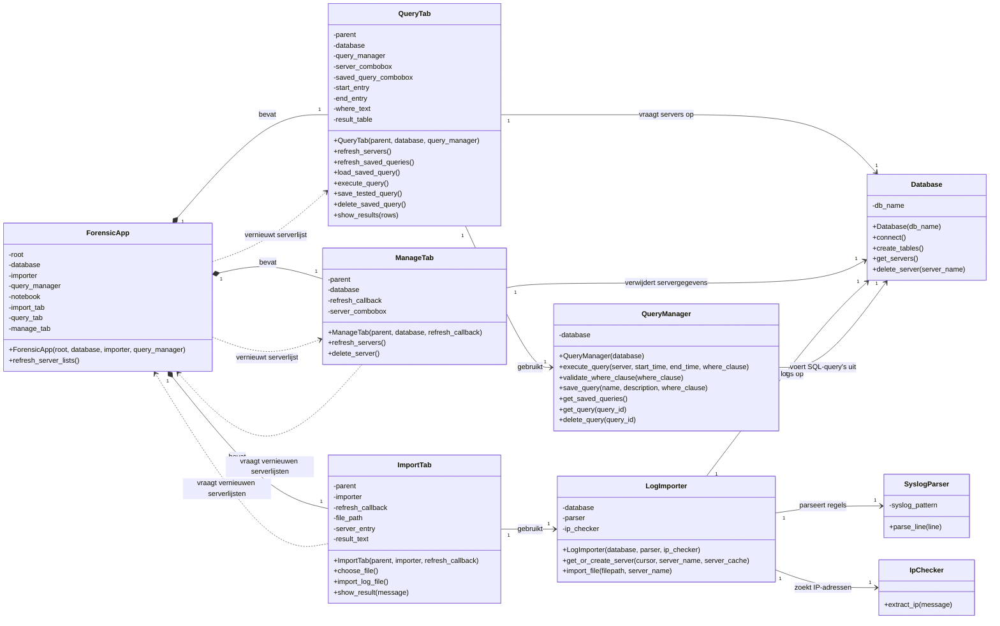

# Dit is de volledige classendiagram van het programma tot nu toe
### In "toelichting_klassediagram_volledig.md" staat de toelichting

```mermaid
classDiagram
    direction LR

    class Database {
        -db_name
        +Database(db_name)
        +connect()
        +create_tables()
        +get_servers()
        +delete_server(server_name)
    }

    class SyslogParser {
        -syslog_pattern
        +parse_line(line)
    }

    class IpChecker {
        +extract_ip(message)
    }

    class LogImporter {
        -database
        -parser
        -ip_checker
        +LogImporter(database, parser, ip_checker)
        +get_or_create_server(cursor, server_name, server_cache)
        +import_file(filepath, server_name)
    }

    class QueryManager {
        -database
        +QueryManager(database)
        +execute_query(server, start_time, end_time, where_clause)
        +validate_where_clause(where_clause)
        +save_query(name, description, where_clause)
        +get_saved_queries()
        +get_query(query_id)
        +delete_query(query_id)
    }

    class ForensicApp {
        -root
        -database
        -importer
        -query_manager
        -notebook
        -import_tab
        -query_tab
        -manage_tab
        +ForensicApp(root, database, importer, query_manager)
        +refresh_server_lists()
    }

    class ImportTab {
        -parent
        -importer
        -refresh_callback
        -file_path
        -server_entry
        -result_text
        +ImportTab(parent, importer, refresh_callback)
        +choose_file()
        +import_log_file()
        +show_result(message)
    }

    class QueryTab {
        -parent
        -database
        -query_manager
        -server_combobox
        -saved_query_combobox
        -start_entry
        -end_entry
        -where_text
        -result_table
        +QueryTab(parent, database, query_manager)
        +refresh_servers()
        +refresh_saved_queries()
        +load_saved_query()
        +execute_query()
        +save_tested_query()
        +delete_saved_query()
        +show_results(rows)
    }

    class ManageTab {
        -parent
        -database
        -refresh_callback
        -server_combobox
        +ManageTab(parent, database, refresh_callback)
        +refresh_servers()
        +delete_server()
    }

    ForensicApp "1" *-- "1" ImportTab : bevat
    ForensicApp "1" *-- "1" QueryTab : bevat
    ForensicApp "1" *-- "1" ManageTab : bevat

    ImportTab "1" --> "1" LogImporter : gebruikt

    QueryTab "1" --> "1" QueryManager : gebruikt
    QueryTab "1" --> "1" Database : vraagt servers op

    ManageTab "1" --> "1" Database : verwijdert servergegevens

    LogImporter "1" --> "1" Database : slaat logs op
    LogImporter "1" --> "1" SyslogParser : parseert regels
    LogImporter "1" --> "1" IpChecker : zoekt IP-adressen

    QueryManager "1" --> "1" Database : voert SQL-query's uit

    ImportTab ..> ForensicApp : vraagt vernieuwen serverlijsten
    ManageTab ..> ForensicApp : vraagt vernieuwen serverlijsten
    ForensicApp ..> QueryTab : vernieuwt serverlijst
    ForensicApp ..> ManageTab : vernieuwt serverlijst
```
