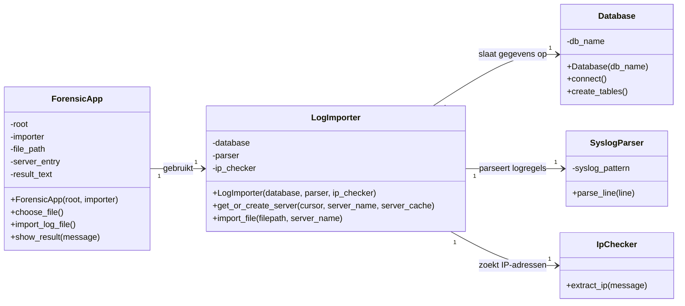

```mermaid
classDiagram
    direction LR

    class Database {
        -db_name
        +Database(db_name)
        +connect()
        +create_tables()
    }

    class SyslogParser {
        -syslog_pattern
        +parse_line(line)
    }

    class IpChecker {
        +extract_ip(message)
    }

    class LogImporter {
        -database
        -parser
        -ip_checker
        +LogImporter(database, parser, ip_checker)
        +get_or_create_server(cursor, server_name, server_cache)
        +import_file(filepath, server_name)
    }

    class ForensicApp {
        -root
        -importer
        -file_path
        -server_entry
        -result_text
        +ForensicApp(root, importer)
        +choose_file()
        +import_log_file()
        +show_result(message)
    }

    ForensicApp "1" --> "1" LogImporter : gebruikt
    LogImporter "1" --> "1" Database : slaat gegevens op
    LogImporter "1" --> "1" SyslogParser : parseert logregels
    LogImporter "1" --> "1" IpChecker : zoekt IP-adressen
```
