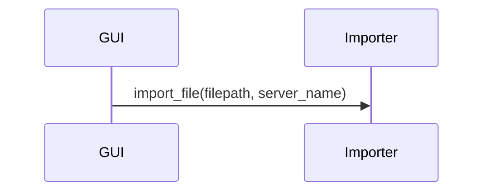
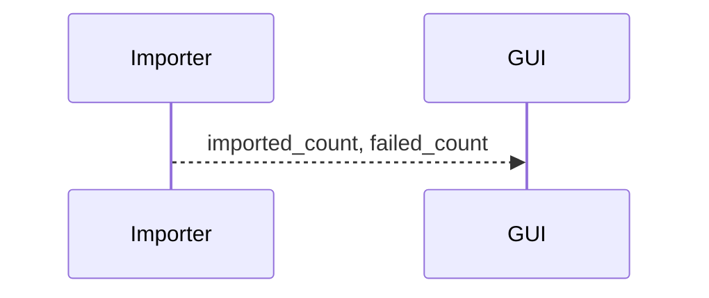
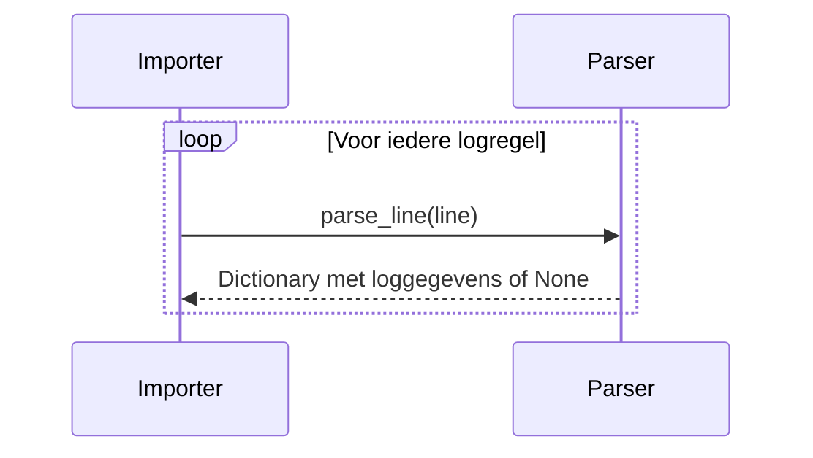
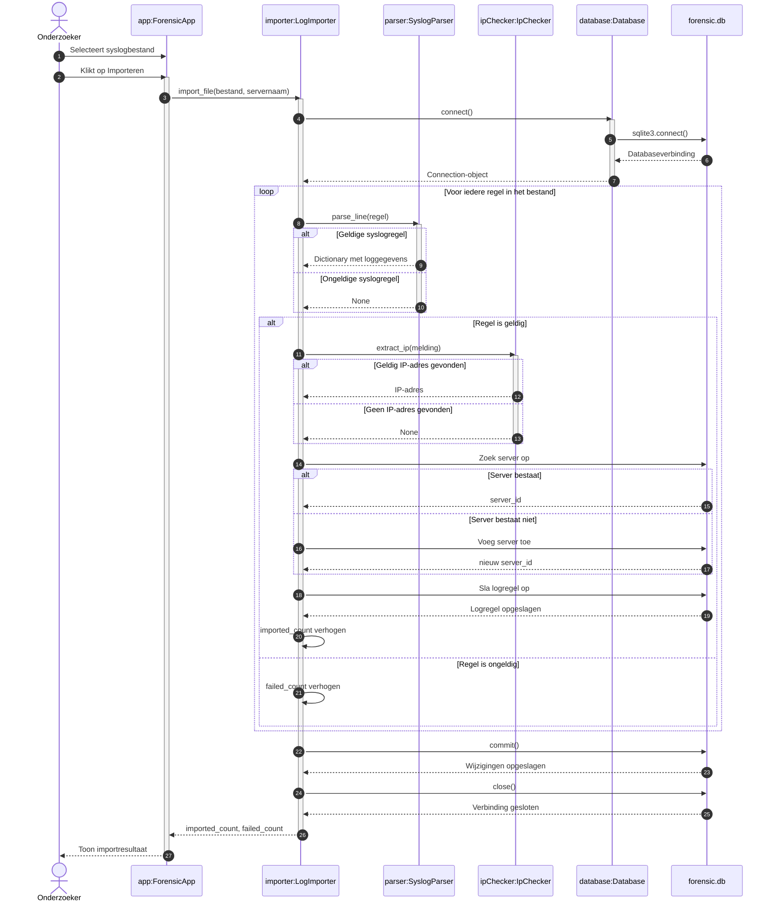

# Message Sequence Diagram voor het importeren van een syslogbestand

**Opleiding:** Fontys Master Docent ICT  
**Versie:** 1.0  
**Auteur:** Rudy Bouland  
**Datum:** 11-06-2026  

## Wat is het?

Een sequence diagram toont welke actor en objecten deelnemen, welke berichten of methodeaanroepen zij uitwisselen en in welke tijdsvolgorde dat gebeurt. De tijd loopt daarbij van boven naar beneden en iedere deelnemer heeft een verticale levenslijn.

## Volgorde van de belangrijkste berichten

1. De onderzoeker selecteert een syslogbestand en start de import.
2. `ForensicApp` roept `import_file()` van `LogImporter` aan.
3. `LogImporter` vraagt via `Database` een SQLite-verbinding op.
4. Voor iedere regel roept de importer `SyslogParser.parse_line()` aan.
5. Bij een geldige regel zoekt `IpChecker` naar een IP-adres.
6. De server wordt opgezocht of toegevoegd.
7. De logregel wordt opgeslagen in SQLite.
8. Na alle regels wordt `commit()` uitgevoerd.
9. `LogImporter` geeft de aantallen terug aan de GUI.
10. De GUI toont het resultaat aan de onderzoeker.

De notatie `app:ForensicApp` betekent dat `app` het object is en `ForensicApp` de klasse waarvan het object is gemaakt.

## Uitleg van de levenslijnen

De deelnemers bovenaan het sequence diagram zijn de actor en objecten:

1. **Onderzoeker** is de externe actor die de applicatie bedient.
2. **`main.py`** maakt de objecten aan en koppelt ze aan elkaar.
3. **`database:Database`** verzorgt de databaseverbinding en de tabellen.
4. **`parser:SyslogParser`** verwerkt iedere syslogregel.
5. **`ipChecker:IpChecker`** zoekt een geldig IP-adres in de melding.
6. **`importer:LogImporter`** bestuurt het volledige importproces.
7. **`app:ForensicApp`** verzorgt de Tkinter-GUI.
8. **`forensic.db`** stelt de SQLite-database voor.

## Gebruikte onderdelen

### Synchrone berichten

Een doorgetrokken pijl stelt een methodeaanroep voor:



De GUI wacht hierbij totdat `import_file()` klaar is.

### Retourberichten

Een gestippelde pijl toont een teruggegeven resultaat:



### Activatiebalken

De commando's:

```text
activate Importer
deactivate Importer
```

tonen de periode waarin een object actief een methode uitvoert.

### Loop en alt

Het `loop`-gedeelte laat zien dat dezelfde handelingen voor iedere niet-lege logregel worden herhaald:



Een `alt`-fragment beschrijft verschillende mogelijke uitkomsten. Bijvoorbeeld:

- de regel is geldig of ongeldig;
- er is wel of geen IP-adres;
- de server bestaat al of moet worden toegevoegd.

Combined fragments zoals `loop`, `alt` en `opt` worden in UML-sequencediagrammen gebruikt om herhaling, alternatieve paden en optionele acties weer te geven.

## Onderbouwing

Dit Message Sequence Diagram beschrijft de levenslijn en samenwerking van de objecten tijdens het starten van de applicatie en het importeren van een syslogbestand. De tijd verloopt van boven naar beneden. De pijlen geven aan welke berichten en methodeaanroepen tussen de actor en de objecten worden uitgewisseld.

Eerst maakt `main.py` de benodigde objecten aan. Daarna selecteert de forensisch onderzoeker via de GUI een syslogbestand. Het `ForensicApp`-object geeft de importopdracht door aan het `LogImporter`-object. De importer gebruikt vervolgens de `SyslogParser`, de `IpChecker` en de `Database` om iedere regel te verwerken en op te slaan.

Het diagram bevat een `loop`, omdat de handelingen voor iedere regel uit het syslogbestand worden herhaald. De `alt`-fragmenten tonen alternatieve situaties, zoals een geldige of ongeldige regel, een gevonden of niet-gevonden IP-adres en een bestaande of nieuwe server. Na het verwerken van alle regels worden de wijzigingen definitief opgeslagen en ontvangt de onderzoeker via de GUI het importresultaat.

## Message Sequence Diagram



## Bibliografie

- Mermaid. (2026). *Mermaid Live Editor*. <https://mermaid.live/>
- Sparx. (2026). *UML 2 Tutorial - Sequence Diagram*. <https://sparxsystems.com/resources/tutorials/uml2/sequence-diagram.html>
