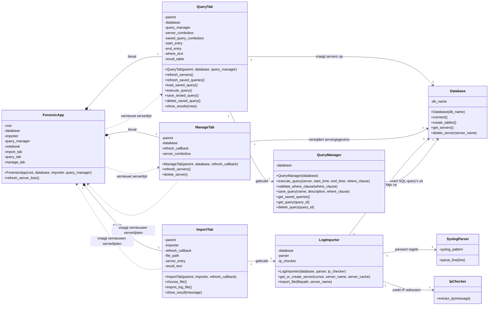
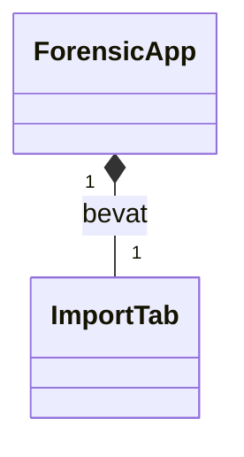
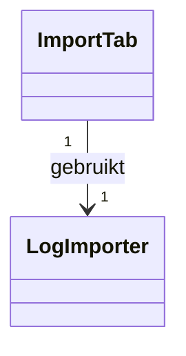
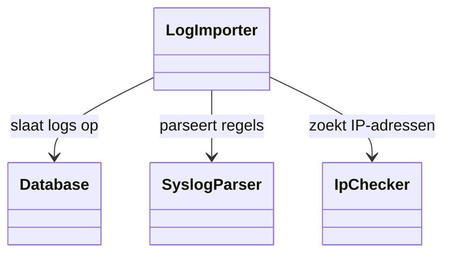
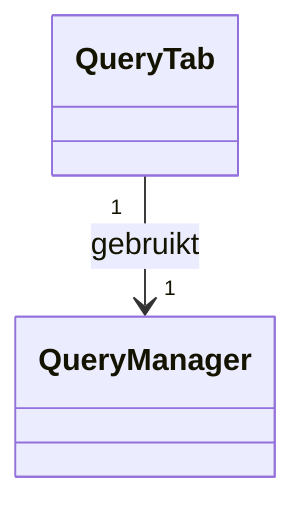
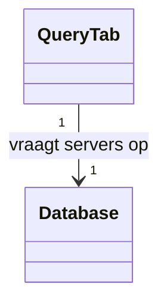
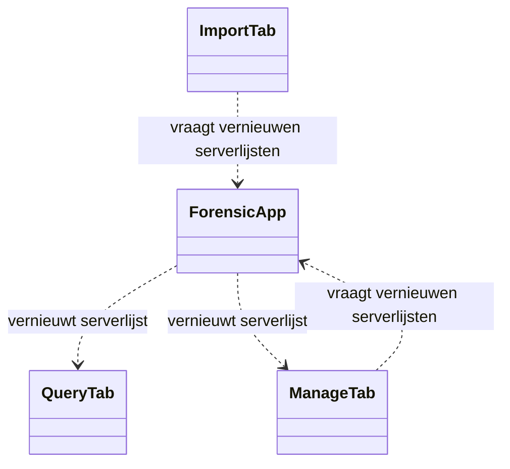

# Toelichting klassendiagram volledige applicatie

## Inleiding

Onderstaand klassendiagram beschrijft de volledige huidige versie van de forensic tool. De applicatie ondersteunt:

- het importeren van syslogbestanden;
- het parseren van syslogregels;
- het herkennen van IP-adressen;
- het opslaan van gegevens in SQLite;
- het uitvoeren van handmatige query's;
- het opslaan en verwijderen van vooraf gemaakte query's;
- het tonen van queryresultaten;
- het verwijderen van servers en bijbehorende logregels.

De applicatie gebruikt objectgeoriënteerd programmeren. Iedere class heeft zoveel mogelijk één duidelijke hoofdverantwoordelijkheid. Dit sluit aan bij het **Single Responsibility Principle**.

---

## Volledig klassendiagram



---

## Betekenis van de UML-symbolen

In het diagram worden de volgende symbolen gebruikt:

| Symbool | Betekenis |
|---|---|
| `+` | Publieke methode |
| `-` | Intern attribuut van een object |
| `*--` | Compositie: het ene object bevat en beheert het andere object |
| `-->` | Associatie: een object gebruikt een ander object |
| `..>` | Afhankelijkheid: een object roept tijdelijk functionaliteit van een ander object aan |
| `"1"` | Er is in deze applicatie één gekoppeld object van die class |

Een voorbeeld van een publiek beschikbare methode is:

```text
+connect()
```

Een voorbeeld van een intern attribuut is:

```text
-db_name
```

Het minteken betekent binnen UML dat het attribuut privé is. Python dwingt dit niet strikt af, maar in het diagram geeft het aan dat het attribuut bedoeld is voor intern gebruik door de class.

---

## Belangrijkste samenhang

### ForensicApp

`ForensicApp` is verantwoordelijk voor het hoofdvenster van de applicatie. De class maakt het Tkinter-venster en de verschillende tabbladen aan.

De class bevat:

- `ImportTab`;
- `QueryTab`;
- `ManageTab`.

De volgende relatie in het diagram betekent compositie:



De gevulde ruit geeft aan dat `ImportTab` onderdeel is van `ForensicApp`. Het tabblad wordt door de applicatie aangemaakt en hoort bij de levensduur van het hoofdvenster.

Hetzelfde geldt voor `QueryTab` en `ManageTab`.

`ForensicApp` heeft daarnaast de methode:

```python
refresh_server_lists()
```

Deze methode vernieuwt de serverkeuzelijsten in de querytab en beheertab. Dit is nodig nadat een nieuw logbestand is geïmporteerd of nadat een server is verwijderd.

---

### ImportTab

`ImportTab` verwerkt alleen het GUI-gedeelte voor het importeren van syslogbestanden.

De belangrijkste taken zijn:

- een syslogbestand selecteren;
- eventueel een servernaam invoeren;
- de import starten;
- het resultaat van de import tonen.

`ImportTab` voert het echte importwerk niet zelf uit. Daarvoor gebruikt het tabblad de class:

```text
LogImporter
```

Dit wordt in het klassendiagram weergegeven met:



Hierdoor hoeft `ImportTab` niet te weten hoe een syslogregel wordt verwerkt of hoe gegevens in SQLite worden opgeslagen. Het tabblad blijft daardoor verantwoordelijk voor slechts één hoofdtaak: de gebruikersinterface voor het importeren.

---

### LogImporter

`LogImporter` bestuurt het volledige importproces.

De class:

1. opent het gekozen syslogbestand;
2. leest het bestand regel voor regel;
3. laat iedere regel verwerken door `SyslogParser`;
4. laat een eventueel IP-adres zoeken door `IpChecker`;
5. zoekt of maakt de juiste server;
6. slaat de logregel op via `Database`;
7. telt geslaagde en mislukte regels.

`LogImporter` gebruikt drie andere classes:

```text
Database
SyslogParser
IpChecker
```

De samenwerking is als volgt:



Deze verdeling voorkomt dat één class alle werkzaamheden zelf uitvoert.

---

### Database

`Database` is verantwoordelijk voor de verbinding met de SQLite-database en voor algemene databasehandelingen.

Belangrijke methodes zijn:

```python
connect()
create_tables()
get_servers()
delete_server(server_name)
```

De methode `connect()` maakt een verbinding met `forensic.db`.

De methode `create_tables()` controleert of de vereiste tabellen bestaan en maakt ze indien nodig aan.

De methode `get_servers()` haalt de beschikbare servernamen uit SQLite. Deze namen worden gebruikt in keuzelijsten, zodat een onderzoeker geen servernaam handmatig verkeerd kan invoeren.

De methode `delete_server(server_name)` verwijdert zowel de geselecteerde server als de bijbehorende logregels.

---

### SyslogParser

`SyslogParser` heeft één hoofdverantwoordelijkheid: een tekstregel uit een syslogbestand omzetten naar bruikbare gegevens.

De methode:

```python
parse_line(line)
```

probeert onder andere de volgende velden uit de regel te halen:

- datum en tijd;
- servernaam;
- service;
- melding.

Wanneer een regel niet voldoet aan het ondersteunde syslogformaat, geeft de parser `None` terug. `LogImporter` telt deze regel vervolgens als mislukt.

---

### IpChecker

`IpChecker` zoekt een IP-adres in de melding van een syslogregel.

De methode:

```python
extract_ip(message)
```

geeft het gevonden IP-adres terug. Wanneer er geen IP-adres wordt gevonden, geeft de methode `None` terug.

Door deze taak in een aparte class te plaatsen, blijft IP-herkenning gescheiden van het parseren en importeren.

---

### QueryTab

`QueryTab` is verantwoordelijk voor de gebruikersinterface waarmee de forensisch onderzoeker loggegevens kan doorzoeken.

De onderzoeker kan in dit tabblad:

- een server selecteren;
- eventueel een begin- en eindtijd invoeren;
- een handmatige queryvoorwaarde invoeren;
- een opgeslagen query selecteren;
- een query uitvoeren;
- resultaten in een scrollbare tabel bekijken;
- een geteste query opslaan;
- een opgeslagen query verwijderen.

`QueryTab` gebruikt `QueryManager` voor het echte querybeheer:



Daarnaast gebruikt `QueryTab` de class `Database` om de serverkeuzelijst te vullen:



De GUI en de querylogica blijven hierdoor gescheiden.

---

### QueryManager

`QueryManager` heeft als hoofdverantwoordelijkheid het uitvoeren en beheren van query's.

De class kan:

- een query controleren;
- een query uitvoeren;
- een query opslaan;
- opgeslagen query's ophalen;
- één opgeslagen query ophalen;
- een opgeslagen query verwijderen.

De belangrijkste methodes zijn:

```python
execute_query(server, start_time, end_time, where_clause)
validate_where_clause(where_clause)
save_query(name, description, where_clause)
get_saved_queries()
get_query(query_id)
delete_query(query_id)
```

`QueryManager` gebruikt `Database` om een SQLite-verbinding te maken en SQL-opdrachten uit te voeren.

De validatiemethode controleert of een handmatig ingevoerde query geen verboden opdrachten bevat, zoals:

```sql
DELETE
DROP
UPDATE
INSERT
```

De gebruiker vult alleen een filtervoorwaarde in. De applicatie bouwt daar zelf een volledige `SELECT`-query omheen.

---

### ManageTab

`ManageTab` is verantwoordelijk voor de gebruikersinterface waarmee servers kunnen worden verwijderd.

De onderzoeker kiest een server uit een keuzelijst die vanuit SQLite wordt gevuld. Dit voorkomt typefouten en het verwijderen van een niet-bestaande server.

Na bevestiging roept `ManageTab` de volgende methode aan:

```python
database.delete_server(server_name)
```

De daadwerkelijke SQL-opdrachten worden dus uitgevoerd door `Database`, niet door `ManageTab`.

Wanneer een server is verwijderd, gebruikt `ManageTab` een callback om `ForensicApp` te laten weten dat de serverkeuzelijsten moeten worden vernieuwd.

---

## Gebruik van callbacks

`ImportTab` en `ManageTab` hebben allebei het attribuut:

```text
-refresh_callback
```

Dit attribuut bevat een verwijzing naar de methode `refresh_server_lists()` van `ForensicApp`.

Na een import of verwijdering kan een tabblad deze callback uitvoeren. `ForensicApp` vernieuwt daarna de lijsten in `QueryTab` en `ManageTab`.

Dit wordt in het diagram weergegeven met afhankelijkheidsrelaties:



Een gestippelde pijl geeft aan dat de classes elkaar tijdelijk nodig hebben voor een bepaalde actie, maar dat er geen sterke bezitsrelatie bestaat.

---

## Vereenvoudigd overzicht

Onderstaand overzicht laat de samenwerking zonder methodes en attributen zien:

```text
ForensicApp
│
├── ImportTab
│      └── LogImporter
│             ├── Database
│             ├── SyslogParser
│             └── IpChecker
│
├── QueryTab
│      ├── QueryManager
│      │      └── Database
│      └── Database
│
└── ManageTab
       └── Database
```

De GUI is verdeeld over drie tabbladen. De tabbladen geven opdrachten door aan classes die verantwoordelijk zijn voor de onderliggende logica.

---

## Waarom main.py niet in het klassendiagram staat

`main.py` staat niet in het klassendiagram, omdat het een Python-module is en geen class.

Het bestand is wel het startpunt van de applicatie. In `main.py` worden de verschillende objecten aangemaakt en aan elkaar gekoppeld:

```python
database = Database("forensic.db")
database.create_tables()

parser = SyslogParser()
ip_checker = IpChecker()

importer = LogImporter(
    database,
    parser,
    ip_checker
)

query_manager = QueryManager(database)

app = ForensicApp(
    root,
    database,
    importer,
    query_manager
)
```

Deze manier van koppelen heet ook wel **dependency injection**. De benodigde objecten worden van buitenaf aan de constructors meegegeven.

In eenvoudige woorden betekent dit dat bijvoorbeeld `LogImporter` niet zelf een nieuwe `Database`, `SyslogParser` of `IpChecker` maakt. Deze objecten worden in `main.py` gemaakt en daarna aan `LogImporter` doorgegeven.

Dit maakt de samenwerking duidelijk en zorgt ervoor dat de classes afzonderlijk kunnen worden getest.

`main.py` heeft dus de volgende rol:

1. de database aanmaken;
2. de tabellen controleren;
3. de parser aanmaken;
4. de IP-checker aanmaken;
5. de importer aanmaken;
6. de querymanager aanmaken;
7. het hoofdvenster aanmaken;
8. de GUI starten.

Hoewel `main.py` niet in het UML-klassendiagram staat, is het bestand wel verantwoordelijk voor het opbouwen en starten van de applicatie.

---

## Relatie met het Single Responsibility Principle

Het Single Responsibility Principle betekent dat een class bij voorkeur één duidelijk omschreven hoofdverantwoordelijkheid heeft.

In deze applicatie is dat als volgt toegepast:

| Class | Hoofdverantwoordelijkheid |
|---|---|
| `Database` | Databaseverbindingen en algemene databasehandelingen |
| `SyslogParser` | Syslogregels parseren |
| `IpChecker` | IP-adressen herkennen |
| `LogImporter` | Het importproces uitvoeren |
| `QueryManager` | Query's uitvoeren en beheren |
| `ForensicApp` | Het hoofdvenster en de tabbladen beheren |
| `ImportTab` | De importinterface tonen |
| `QueryTab` | De queryinterface en resultaten tonen |
| `ManageTab` | De interface voor het verwijderen van servers tonen |

Door deze verdeling blijft de code overzichtelijker. Een wijziging aan de queryfunctionaliteit hoeft bijvoorbeeld niet in de syslogparser of IP-checker te worden uitgevoerd.

---

## Conclusie

Het klassendiagram laat zien dat de applicatie is verdeeld in classes met afzonderlijke verantwoordelijkheden.

De GUI-classes verwerken de interactie met de gebruiker. De classes `LogImporter` en `QueryManager` bevatten de belangrijkste toepassingslogica. De classes `Database`, `SyslogParser` en `IpChecker` verzorgen specifieke technische taken.

Deze verdeling maakt de samenhang van de software beter zichtbaar en voorkomt dat alle functionaliteit in één grote class of module wordt geplaatst.
