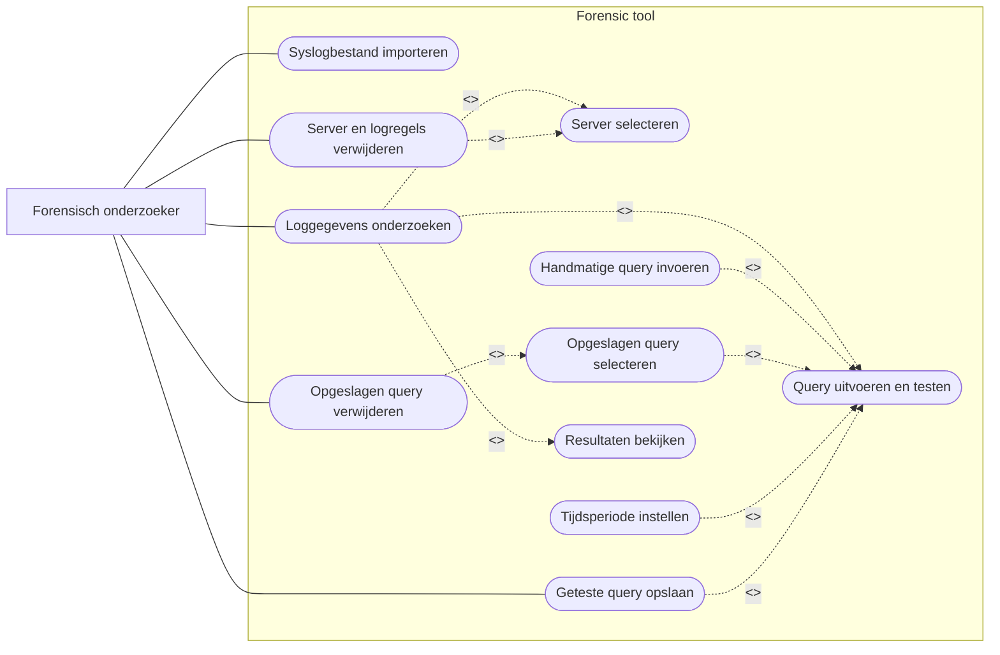

# Toelichting Use Case-diagram forensic tool

## Inleiding

Dit document beschrijft de use cases van de huidige versie van de forensic tool.

Een Use Case-diagram laat zien:

- welke actor de applicatie gebruikt;
- welke functies de applicatie aanbiedt;
- welke functies altijd onderdeel zijn van een andere use case;
- welke functies optioneel of voorwaardelijk worden uitgevoerd.

De primaire actor in dit systeem is de **forensisch onderzoeker**. Deze gebruikt de applicatie om syslogbestanden te importeren, loggegevens te onderzoeken, query's te beheren en niet meer benodigde servergegevens te verwijderen.

Mermaid heeft geen afzonderlijk UML-diagramtype voor use cases. Daarom is het diagram opgebouwd als een `flowchart`, waarbij afgeronde vormen de use cases voorstellen.

---

## Use Case-diagram forensic tool



---

## Actor

### Forensisch onderzoeker

De forensisch onderzoeker is de primaire gebruiker van de applicatie.

De onderzoeker gebruikt de forensic tool om:

- syslogbestanden te importeren;
- een server te selecteren;
- loggegevens te doorzoeken;
- query's uit te voeren;
- queryresultaten te bekijken;
- veelgebruikte query's op te slaan;
- opgeslagen query's te verwijderen;
- servers en gekoppelde logregels te verwijderen.

Er is in de huidige versie één actor opgenomen. Gebruikersbeheer en verschillende gebruikersrollen vallen nog buiten de scope van de applicatie.

---

## Beschrijving van de use cases

## UC1 – Syslogbestand importeren

### Doel

Een syslogbestand van een Linux-server importeren en de geldige logregels opslaan in SQLite.

### Actor

Forensisch onderzoeker.

### Voorwaarden

- De applicatie is gestart.
- Het syslogbestand is beschikbaar op het systeem.
- Het bestand bevat regels in een ondersteund syslogformaat.

### Normaal verloop

1. De onderzoeker opent het tabblad voor importeren.
2. De onderzoeker kiest een syslogbestand.
3. De onderzoeker vult eventueel een afwijkende servernaam in.
4. De onderzoeker start de import.
5. De applicatie leest het bestand regel voor regel.
6. Geldige logregels worden geparsed.
7. Eventuele IP-adressen worden uit de melding gehaald.
8. De server wordt opgezocht of toegevoegd.
9. De logregels worden opgeslagen in SQLite.
10. De applicatie toont het aantal geïmporteerde en mislukte regels.

### Alternatief verloop

- Een ongeldige logregel wordt niet opgeslagen.
- De foutenteller wordt verhoogd.
- De import van de overige regels gaat verder.

### Resultaat

De geldige logregels staan in de database en zijn gekoppeld aan de juiste server.

---

## UC2 – Server selecteren

### Doel

Een bestaande server selecteren waarvan de loggegevens moeten worden onderzocht of verwijderd.

### Actor

Forensisch onderzoeker.

### Voorwaarden

Er staat minimaal één server in de tabel `servers`.

### Normaal verloop

1. De applicatie vraagt de servernamen op uit SQLite.
2. De servernamen worden in een keuzelijst geplaatst.
3. De onderzoeker kiest een server.

### Resultaat

De geselecteerde server kan worden gebruikt bij een query of verwijderactie.

### Onderbouwing

De server wordt gekozen uit een SQL-gevulde keuzelijst. Hierdoor hoeft de onderzoeker de servernaam niet handmatig in te voeren en worden typefouten voorkomen.

---

## UC3 – Loggegevens onderzoeken

### Doel

De loggegevens van een geselecteerde server doorzoeken en de resultaten bekijken.

### Actor

Forensisch onderzoeker.

### Voorwaarden

- Er zijn loggegevens geïmporteerd.
- Er is een server beschikbaar.

### Normaal verloop

1. De onderzoeker opent het tabblad voor onderzoek.
2. De onderzoeker selecteert een server.
3. De onderzoeker kiest een handmatige of opgeslagen query.
4. De onderzoeker stelt eventueel een tijdsperiode in.
5. De query wordt uitgevoerd.
6. De resultaten worden in een scrollbare tabel getoond.

### Resultaat

De onderzoeker ziet de logregels die voldoen aan de ingestelde selectie.

### Relaties

Deze use case bevat altijd:

- `Server selecteren`;
- `Query uitvoeren en testen`;
- `Resultaten bekijken`.

Daarom zijn deze use cases met `<<include>>` gekoppeld.

---

## UC4 – Handmatige query invoeren

### Doel

Zelf een SQL-filtervoorwaarde invoeren om specifieke logregels te zoeken.

### Actor

Forensisch onderzoeker.

### Voorwaarden

De onderzoeker bevindt zich in het querytabblad.

### Normaal verloop

1. De onderzoeker voert een filtervoorwaarde in.
2. De applicatie controleert of de invoer geen verboden SQL-opdrachten bevat.
3. De filtervoorwaarde wordt aan de hoofdquery toegevoegd.
4. De query wordt uitgevoerd.

### Voorbeeld

```sql
service = 'sshd' AND message LIKE '%Failed password%'
```

### Resultaat

De query wordt gebruikt om de loggegevens te filteren.

### Relatie

Deze use case is een uitbreiding op `Query uitvoeren en testen`. De onderzoeker kan namelijk ook een opgeslagen query selecteren.

---

## UC5 – Opgeslagen query selecteren

### Doel

Een eerder opgeslagen en geteste query opnieuw gebruiken.

### Actor

Forensisch onderzoeker.

### Voorwaarden

Er staat minimaal één query in de tabel `saved_queries`.

### Normaal verloop

1. De applicatie haalt de opgeslagen query's uit SQLite.
2. De querynamen worden in een keuzelijst getoond.
3. De onderzoeker kiest een query.
4. De applicatie laadt de naam, beschrijving en filtervoorwaarde.
5. De filtervoorwaarde wordt in de GUI getoond.
6. De onderzoeker kan de query uitvoeren.

### Resultaat

De eerder opgeslagen filtervoorwaarde is opnieuw beschikbaar.

### Relatie

Deze use case is een mogelijke uitbreiding op `Query uitvoeren en testen`.

---

## UC6 – Tijdsperiode instellen

### Doel

De query beperken tot logregels binnen een bepaalde periode.

### Actor

Forensisch onderzoeker.

### Voorwaarden

De onderzoeker bevindt zich in het querytabblad.

### Normaal verloop

1. De onderzoeker voert een begintijd in.
2. De onderzoeker voert een eindtijd in.
3. De applicatie voegt de tijdsvoorwaarden aan de query toe.
4. Alleen logregels binnen de ingestelde periode worden geselecteerd.

### Resultaat

De queryresultaten bevatten alleen logregels uit de gekozen tijdsperiode.

### Relatie

Het instellen van een tijdsperiode is optioneel. Daarom is deze use case met `<<extend>>` gekoppeld aan `Query uitvoeren en testen`.

---

## UC7 – Query uitvoeren en testen

### Doel

De samengestelde query controleren en uitvoeren op de geselecteerde loggegevens.

### Actor

Forensisch onderzoeker.

### Voorwaarden

- Er is een server geselecteerd, of de optie voor alle servers is gekozen.
- Er is een geldige filtervoorwaarde of een lege filtervoorwaarde aanwezig.

### Normaal verloop

1. De onderzoeker klikt op de knop om de query uit te voeren.
2. De applicatie controleert de filtervoorwaarde.
3. De applicatie bouwt een volledige `SELECT`-query.
4. De geselecteerde server wordt als parameter toegevoegd.
5. De tijdsperiode wordt eventueel toegevoegd.
6. SQLite voert de query uit.
7. De gevonden rijen worden teruggegeven aan de GUI.

### Alternatief verloop

Wanneer de filtervoorwaarde een verboden opdracht bevat, zoals `DELETE`, `DROP`, `UPDATE` of `INSERT`, wordt de query geweigerd en verschijnt een foutmelding.

### Resultaat

De query is succesvol getest en de resultaten zijn beschikbaar.

---

## UC8 – Resultaten bekijken

### Doel

De gevonden logregels overzichtelijk bekijken.

### Actor

Forensisch onderzoeker.

### Voorwaarden

Er is een query uitgevoerd.

### Normaal verloop

1. De applicatie ontvangt de gevonden rijen uit SQLite.
2. De bestaande inhoud van de resultaattabel wordt gewist.
3. De gevonden logregels worden toegevoegd.
4. De onderzoeker kan verticaal en horizontaal door de resultaten scrollen.

### Getoonde gegevens

De tabel toont onder andere:

- datum en tijd;
- server;
- service;
- melding;
- IP-adres.

### Resultaat

De onderzoeker kan de geselecteerde logregels analyseren.

---

## UC9 – Geteste query opslaan

### Doel

Een succesvol uitgevoerde query bewaren voor later gebruik.

### Actor

Forensisch onderzoeker.

### Voorwaarden

- De query is succesvol uitgevoerd.
- De filtervoorwaarde is na het testen niet gewijzigd.
- De onderzoeker heeft een naam ingevuld.

### Normaal verloop

1. De onderzoeker test een handmatige query.
2. De onderzoeker controleert de resultaten.
3. De onderzoeker vult een begrijpelijke naam in.
4. De onderzoeker vult eventueel een beschrijving in.
5. De onderzoeker kiest voor opslaan.
6. De applicatie bewaart de query in `saved_queries`.

### Resultaat

De query verschijnt in de keuzelijst met opgeslagen query's.

### Relatie

Deze use case wordt alleen uitgevoerd na een succesvolle test. Daarom is deze gekoppeld met:

```text
<<extend: na succesvolle test>>
```

---

## UC10 – Opgeslagen query verwijderen

### Doel

Een query verwijderen die niet meer nodig is.

### Actor

Forensisch onderzoeker.

### Voorwaarden

Er staat minimaal één opgeslagen query in de database.

### Normaal verloop

1. De onderzoeker selecteert een opgeslagen query.
2. De onderzoeker kiest voor verwijderen.
3. De applicatie vraagt om bevestiging.
4. De onderzoeker bevestigt de verwijdering.
5. De query wordt uit `saved_queries` verwijderd.
6. De keuzelijst wordt vernieuwd.

### Alternatief verloop

Wanneer de onderzoeker de actie annuleert, blijft de query opgeslagen.

### Resultaat

De geselecteerde query is niet meer beschikbaar.

### Relatie

Voor deze use case moet eerst een opgeslagen query worden geselecteerd. Daarom bevat deze use case `Opgeslagen query selecteren`.

---

## UC11 – Server en logregels verwijderen

### Doel

Een server en alle bijbehorende logregels uit de database verwijderen.

### Actor

Forensisch onderzoeker.

### Voorwaarden

Er staat minimaal één server in de database.

### Normaal verloop

1. De onderzoeker opent het beheertabblad.
2. De onderzoeker selecteert een server uit de keuzelijst.
3. De onderzoeker kiest voor verwijderen.
4. De applicatie vraagt om bevestiging.
5. De gekoppelde logregels worden verwijderd.
6. De server wordt verwijderd.
7. De wijziging wordt met `commit()` opgeslagen.
8. De serverkeuzelijsten worden vernieuwd.

### Alternatief verloop

Wanneer de onderzoeker de verwijdering niet bevestigt, worden geen gegevens verwijderd.

### Resultaat

De server en alle gekoppelde logregels zijn uit de database verwijderd.

### Relatie

Voor het verwijderen moet eerst een server worden geselecteerd. Daarom bevat deze use case `Server selecteren`.

---

## Betekenis van de relaties

### Associatie

Een normale lijn tussen de actor en een use case betekent dat de actor de use case kan starten.

Voorbeeld:

```text
Forensisch onderzoeker --- Syslogbestand importeren
```

---

### `<<include>>`

Een `include`-relatie betekent dat een use case altijd onderdeel is van een andere use case.

Voorbeeld:

```text
Loggegevens onderzoeken
    <<include>>
Server selecteren
```

De onderzoeker moet een server selecteren om de loggegevens van die server te kunnen onderzoeken.

Andere voorbeelden in het diagram zijn:

- loggegevens onderzoeken bevat query uitvoeren;
- loggegevens onderzoeken bevat resultaten bekijken;
- server verwijderen bevat server selecteren;
- opgeslagen query verwijderen bevat opgeslagen query selecteren.

---

### `<<extend>>`

Een `extend`-relatie betekent dat een use case optioneel of voorwaardelijk wordt uitgevoerd.

Voorbeeld:

```text
Tijdsperiode instellen
    <<extend>>
Query uitvoeren en testen
```

Een query kan zonder tijdsperiode worden uitgevoerd. Het instellen van de tijd is dus een optionele uitbreiding.

Ook het invoeren van een handmatige query en het selecteren van een opgeslagen query zijn alternatieve uitbreidingen op het uitvoeren van een query.

---

## Vereenvoudigd overzicht

```text
Forensisch onderzoeker
│
├── Syslogbestand importeren
│
├── Loggegevens onderzoeken
│   ├── Server selecteren
│   ├── Handmatige query invoeren
│   ├── Opgeslagen query selecteren
│   ├── Tijdsperiode instellen
│   ├── Query uitvoeren en testen
│   └── Resultaten bekijken
│
├── Geteste query opslaan
├── Opgeslagen query verwijderen
└── Server en logregels verwijderen
```

---

## Afbakening

Het Use Case-diagram beschrijft de functies van de huidige versie van de forensic tool.

De volgende mogelijke uitbreidingen vallen nog buiten deze versie:

- automatisch verdachte inlogpogingen herkennen;
- IP-adressen buiten Nederland of Europa detecteren;
- vertrouwde IP-reeksen importeren;
- resultaten exporteren naar CSV;
- auditlogging;
- gebruikersbeheer;
- grafische tijdlijnanalyse.

Deze functies kunnen in een volgende ontwikkelfase als nieuwe use cases aan het model worden toegevoegd.

---

## Conclusie

Het Use Case-diagram laat zien welke functies de forensic onderzoeker met de applicatie kan uitvoeren.

De belangrijkste use cases zijn het importeren van syslogbestanden, het onderzoeken van loggegevens, het beheren van opgeslagen query's en het verwijderen van servergegevens.

Door gebruik te maken van `<<include>>` en `<<extend>>` wordt zichtbaar welke handelingen verplicht onderdeel zijn van een proces en welke handelingen optioneel of voorwaardelijk zijn.
