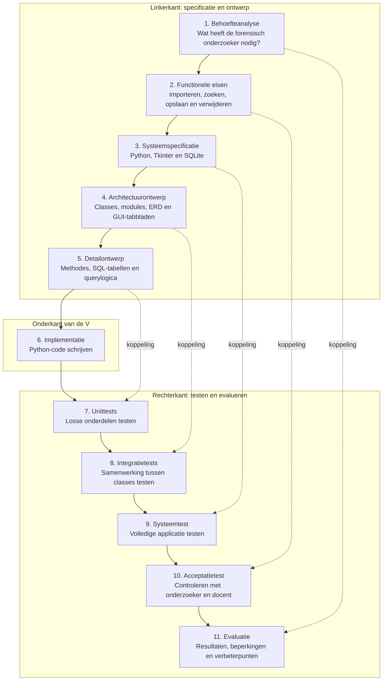

# Toelichting V-model ontwikkeling forensic tool
**Opleiding:** Fontys Master Docent ICT  
**Auteur:** Rudy Bouland  
**Datum:** 14-06-2026  

## Inleiding

Voor de ontwikkeling van de forensic tool is het V-model gebruikt als hulpmiddel om de stappen van analyse, ontwerp, implementatie en testen overzichtelijk weer te geven.

Het V-model laat zien dat softwareontwikkeling niet alleen bestaat uit programmeren. Aan de linkerkant van het model worden de eisen en het ontwerp steeds verder uitgewerkt. Onderaan wordt de software gebouwd. Aan de rechterkant wordt vervolgens gecontroleerd of de verschillende onderdelen en de volledige applicatie voldoen aan de eerder opgestelde eisen.
Overigens, het lukte niet om in Mermaid een echte linker en rechter kant te krijgen, dus gaat de V hier van boven naar beneden.

De linker- en rechterkant horen bij elkaar. Een ontwerpbeslissing aan de linkerkant krijgt een bijpassende test aan de rechterkant.

---

## V-model van de forensic tool



---

## Linkerkant van het V-model

### 1. Behoefteanalyse

In de behoefteanalyse wordt bepaald welk probleem de applicatie moet oplossen.

De forensic onderzoeker wil syslogbestanden van Linux-servers kunnen importeren, onderzoeken en beheren. De belangrijkste behoefte is dat grote hoeveelheden logregels overzichtelijk kunnen worden opgeslagen en doorzocht.

De belangrijkste gebruikersbehoeften zijn:

- syslogbestanden importeren;
- logregels aan de juiste server koppelen;
- een server kunnen selecteren;
- logregels kunnen doorzoeken;
- een tijdsperiode kunnen instellen;
- handmatige query's kunnen uitvoeren;
- veelgebruikte query's kunnen opslaan;
- opgeslagen query's kunnen verwijderen;
- servers en bijbehorende logregels kunnen verwijderen;
- resultaten in een scrollbaar venster kunnen bekijken.

De behoefteanalyse vormt het hoogste en meest algemene niveau van het model.

---

### 2. Functionele eisen

De behoeften zijn omgezet naar concrete functies van de applicatie.

Voorbeelden van functionele eisen zijn:

1. De gebruiker kan via de GUI een syslogbestand selecteren.
2. De applicatie leest het bestand regel voor regel.
3. Geldige logregels worden opgeslagen in SQLite.
4. Ongeldige regels worden niet opgeslagen en worden als fout geteld.
5. De gebruiker kan een server kiezen uit een keuzelijst.
6. De gebruiker kan een begin- en eindtijd invoeren.
7. De gebruiker kan een handmatige SQL-filtervoorwaarde invoeren.
8. Een geteste query kan met een naam en beschrijving worden opgeslagen.
9. Een opgeslagen query kan opnieuw worden gebruikt.
10. Een opgeslagen query kan worden verwijderd.
11. Een server en alle gekoppelde logregels kunnen worden verwijderd.
12. Queryresultaten worden in een scrollbare tabel getoond.

Deze functionele eisen worden later tijdens de acceptatietest gecontroleerd.

---

### 3. Systeemspecificatie

In de systeemspecificatie worden de technische keuzes vastgelegd.

| Onderdeel | Gekozen oplossing |
|---|---|
| Programmeertaal | Python |
| Grafische interface | Tkinter |
| Database | SQLite |
| Testframework | pytest |
| Diagrammen | Mermaid |
| Ondersteunde systemen | Windows en Linux |
| Invoer | Linux-syslogbestanden |
| Uitvoer | Scrollbare tabel met logresultaten |

De applicatie wordt gestart via `main.py`. De database wordt lokaal opgeslagen in het bestand `forensic.db`.

Tijdens de systeemtest wordt gecontroleerd of al deze onderdelen gezamenlijk correct werken.

---

### 4. Architectuurontwerp

In het architectuurontwerp is de applicatie verdeeld in modules en classes.

De belangrijkste classes zijn:

- `Database`;
- `SyslogParser`;
- `IpChecker`;
- `LogImporter`;
- `QueryManager`;
- `ForensicApp`;
- `ImportTab`;
- `QueryTab`;
- `ManageTab`.

Iedere class heeft één duidelijke hoofdverantwoordelijkheid. Dit sluit aan bij het Single Responsibility Principle.

Voorbeelden:

- `SyslogParser` verwerkt syslogregels;
- `IpChecker` zoekt IP-adressen;
- `LogImporter` bestuurt het importproces;
- `QueryManager` voert query's uit en beheert opgeslagen query's;
- `Database` verzorgt databasehandelingen;
- de GUI is verdeeld over afzonderlijke tabbladen.

In deze fase zijn ook het klassendiagram, ERD, de use cases en de Message Sequence Diagrammen gemaakt.

De integratietests controleren later of de verschillende classes correct samenwerken.

---

### 5. Detailontwerp

In het detailontwerp wordt per class beschreven welke methodes nodig zijn.

Voorbeelden zijn:

```text
Database.connect()
Database.create_tables()
Database.get_servers()
Database.delete_server()

SyslogParser.parse_line()

IpChecker.extract_ip()

LogImporter.import_file()

QueryManager.execute_query()
QueryManager.validate_where_clause()
QueryManager.save_query()
QueryManager.get_saved_queries()
QueryManager.delete_query()
```

Ook de databasestructuur wordt in deze fase uitgewerkt.

De belangrijkste tabellen zijn:

```text
servers
logs
saved_queries
```

De tabel `servers` bevat de servernamen. De tabel `logs` bevat de geïmporteerde syslogregels. De tabel `saved_queries` bevat de naam, beschrijving en filtervoorwaarde van opgeslagen query's.

De unittests controleren later of afzonderlijke methodes en classes correct werken.

---

## Onderkant van het V-model

### 6. Implementatie

Onderaan het V-model wordt het ontwerp omgezet naar werkende Python-code.

De applicatie is verdeeld over meerdere bestanden en mappen:

```text
forensic_tool/
│
├── main.py
├── database/
│   └── db.py
├── parser/
│   └── syslog_parser.py
├── importer/
│   └── import_logs.py
├── analysis/
│   └── queries.py
├── ip/
│   └── ip_checker.py
├── gui/
│   ├── app.py
│   ├── import_tab.py
│   ├── query_tab.py
│   └── manage_tab.py
└── tests/
```

Tijdens de implementatie worden de classes en methodes uit het ontwerp daadwerkelijk geprogrammeerd.

Na de implementatie begint de rechterkant van het V-model: het testen.

---

## Rechterkant van het V-model

### 7. Unittests

Bij unittests worden kleine onderdelen afzonderlijk getest.

Voorbeelden zijn:

- controleren of `IpChecker` een geldig IP-adres herkent;
- controleren of `SyslogParser` een geldige syslogregel verwerkt;
- controleren of een ongeldige regel wordt afgewezen;
- controleren of `QueryManager` een verboden SQL-opdracht weigert.

Een unittest controleert dus één duidelijke functie of methode zonder de volledige applicatie te starten.

De unittests horen bij het detailontwerp, omdat zij controleren of de afzonderlijke bouwstenen correct zijn geïmplementeerd.

---

### 8. Integratietests

Bij integratietests wordt gecontroleerd of meerdere classes goed samenwerken.

Een belangrijk voorbeeld is de importketen:

```text
LogImporter
    gebruikt SyslogParser
    gebruikt IpChecker
    gebruikt Database
```

De integratietest controleert bijvoorbeeld of:

1. een bestand kan worden gelezen;
2. een regel correct wordt geparsed;
3. een IP-adres wordt gevonden;
4. een server wordt gekoppeld;
5. de logregel in SQLite wordt opgeslagen.

Ook kan worden getest of `QueryManager` samen met `Database` query's correct uitvoert en opslaat.

De integratietests horen bij het architectuurontwerp.

---

### 9. Systeemtest

Bij de systeemtest wordt de volledige applicatie als één geheel getest.

Voorbeelden van systeemtesten zijn:

1. De applicatie starten met `python3 main.py`.
2. Een syslogbestand importeren.
3. Controleren of de server in de keuzelijst verschijnt.
4. Een handmatige query uitvoeren.
5. Een tijdsperiode instellen.
6. Queryresultaten in de tabel controleren.
7. Een query opslaan en opnieuw laden.
8. Een opgeslagen query verwijderen.
9. Een server en de gekoppelde logregels verwijderen.
10. De applicatie opnieuw starten en controleren of de databasegegevens behouden zijn.

Daarnaast wordt gecontroleerd of de applicatie op Windows en Linux werkt.

De systeemtest hoort bij de systeemspecificatie.

---

### 10. Acceptatietest

Tijdens de acceptatietest wordt gecontroleerd of de applicatie voldoet aan de verwachtingen van de forensic onderzoeker en de beoordelingscriteria van de docent.

Mogelijke acceptatiecriteria zijn:

| Nummer | Acceptatiecriterium |
|---|---|
| A1 | Een syslogbestand kan via de GUI worden geselecteerd |
| A2 | Geldige logregels worden in SQLite opgeslagen |
| A3 | Ongeldige regels veroorzaken geen crash |
| A4 | Een server kan uit een keuzelijst worden gekozen |
| A5 | Een handmatige query kan worden uitgevoerd |
| A6 | Een tijdsperiode kan worden ingesteld |
| A7 | Een geteste query kan worden opgeslagen |
| A8 | Een opgeslagen query kan opnieuw worden gebruikt |
| A9 | Een opgeslagen query kan worden verwijderd |
| A10 | Een server en gekoppelde logs kunnen worden verwijderd |
| A11 | Queryresultaten zijn scrollbaar |
| A12 | De applicatie werkt op Windows en Linux |

Wanneer aan deze criteria is voldaan, kan de applicatie worden geaccepteerd.

---

### 11. Evaluatie

In de evaluatie wordt teruggekeken op het ontwikkelproces en het eindresultaat.

Daarbij kunnen de volgende vragen worden beantwoord:

- Zijn alle functionele eisen gerealiseerd?
- Welke tests zijn uitgevoerd?
- Welke fouten zijn tijdens de ontwikkeling gevonden?
- Welke ontwerpkeuzes zijn gemaakt?
- Wat werkte goed?
- Wat was moeilijk?
- Welke onderdelen kunnen later worden verbeterd?

Mogelijke toekomstige uitbreidingen zijn:

- verdachte inlogpogingen automatisch herkennen;
- IP-adressen buiten Nederland of Europa detecteren;
- vertrouwde IP-reeksen importeren;
- resultaten exporteren naar CSV;
- bestandsnamen in logmeldingen terugzoeken;
- grafische tijdlijnanalyse;
- auditlogging;
- gebruikersbeheer.

De evaluatie hoort bij de oorspronkelijke behoefteanalyse, omdat hier wordt beoordeeld of het probleem van de gebruiker daadwerkelijk voldoende is opgelost.

---

## Koppeling tussen ontwerp en testen

De gestippelde lijnen in het V-model geven aan welke ontwerpstap bij welke testfase hoort.

| Ontwerpfase | Bijbehorende testfase |
|---|---|
| Behoefteanalyse | Evaluatie |
| Functionele eisen | Acceptatietest |
| Systeemspecificatie | Systeemtest |
| Architectuurontwerp | Integratietest |
| Detailontwerp | Unittest |

Deze koppeling zorgt ervoor dat iedere eis of ontwerpkeuze later aantoonbaar wordt gecontroleerd.

Bijvoorbeeld:

- De eis dat een server uit een keuzelijst gekozen moet kunnen worden, wordt gecontroleerd tijdens de acceptatietest.
- De samenwerking tussen `LogImporter`, `SyslogParser`, `IpChecker` en `Database` wordt gecontroleerd met een integratietest.
- De methode `extract_ip()` wordt gecontroleerd met een unittest.

---

## Samenvatting

Het V-model laat zien dat de ontwikkeling van de forensic tool stapsgewijs is uitgevoerd.

Aan de linkerkant worden de eisen en het ontwerp steeds concreter:

```text
Behoefteanalyse
    ↓
Functionele eisen
    ↓
Systeemspecificatie
    ↓
Architectuurontwerp
    ↓
Detailontwerp
```

Onderaan wordt de applicatie geïmplementeerd.

Aan de rechterkant wordt van klein naar groot getest:

```text
Unittests
    ↑
Integratietests
    ↑
Systeemtest
    ↑
Acceptatietest
    ↑
Evaluatie
```

Door deze werkwijze kan worden aangetoond dat zowel de afzonderlijke classes als de volledige forensic tool correct werken en aansluiten op de oorspronkelijke behoeften.
